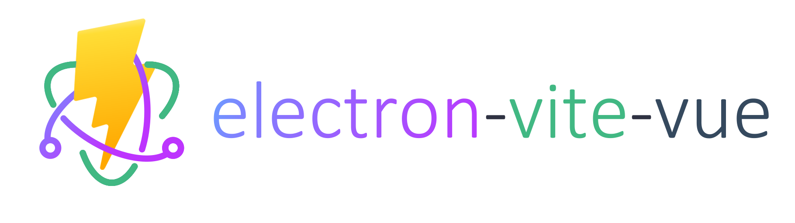

## Quick Start
```bash
git clone https://github.com/Eling486/electron-vite-vue.git
cd electron-vite-vue
yarn
yarn electron:dev
```

## Generate Icon
```bash
yarn icons
```

## Build Application
```bash
yarn electron:build
```

## File Tree
```
electron-vite-vue
├─src
│ ├─main
│ │ ├─modules/
│ │ └─index.js
│ ├─preload
│ │ └─preload.js
│ └─renderer
│   ├─assets
│   │ ├─css
│   │ └─images
│   ├─components/
│   ├─pages/
│   ├─router/
│   └─store/
├─.gitignore
├─index.html
├─package.json
├─README.md
└─vite.config.js
```